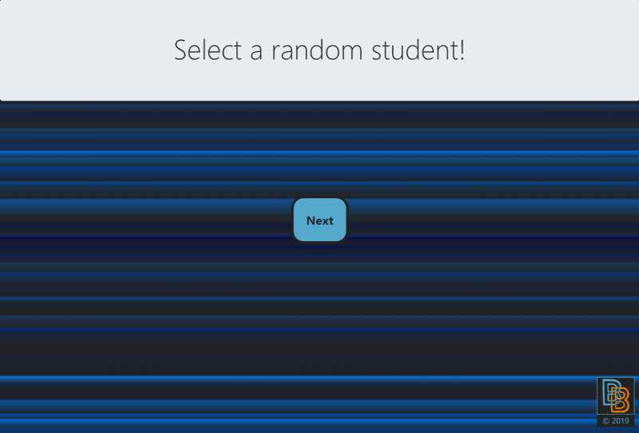

[![Contributors][contributors-shield]][contributors-url]
[![Forks][forks-shield]][forks-url]
[![Stargazers][stars-shield]][stars-url]
[![Issues][issues-shield]][issues-url]
[![MIT License][license-shield]][license-url]
[![LinkedIn][linkedin-shield]][linkedin-url]

# Random Selector

## Description 
A random selector app created with HTML, CSS, Bootstrap, and JavaScript.  Click the center button and a random students name is displayed at the top of the page.  The app will cycle through the whole list before re-shuffling and starting over, so everyone will be called upon an equal amount of times.  The current order is also saved in local storage so I can keep going the next time I log on.

## Images
Starting View:

## Installation 
If all files are kept in a single folder a web browser should be able to run the project and you have an internet connection.

## Usage 
This app is for me to randomly select students from my boot-camp to answer the next question.

## Credits 
Fisher-Yates shuffle function taken from https://frankmitchell.org/2015/01/fisher-yates/

## Contributing 
Contributions are what make the open source community such an amazing place to be learn, inspire, and create. Any contributions you make are **greatly appreciated**.

1. Fork the Project
2. Create your Feature Branch (`git checkout -b feature/AmazingFeature`)
3. Commit your Changes (`git commit -m 'Add some AmazingFeature'`)
4. Push to the Branch (`git push origin feature/AmazingFeature`)
5. Open a Pull Request

## Live site: 
https://bryanbloomquist.github.io/random-selector/

## License
Distributed under the [MIT](https://choosealicense.com/licenses/mit/) License. See `LICENSE` for more information.

[contributors-shield]: https://img.shields.io/github/contributors/bryanbloomquist/random-selector.svg?style=flat-square
[contributors-url]: https://github.com/bryanbloomquist/random-selector/graphs/contributors
[forks-shield]: https://img.shields.io/github/forks/bryanbloomquist/random-selector.svg?style=flat-square
[forks-url]: https://github.com/bryanbloomquist/random-selector/network/members
[stars-shield]: https://img.shields.io/github/stars/bryanbloomquist/random-selector.svg?style=flat-square
[stars-url]: https://github.com/bryanbloomquist/random-selector/stargazers
[issues-shield]: https://img.shields.io/github/issues/bryanbloomquist/random-selector.svg?style=flat-square
[issues-url]: https://github.com/bryanbloomquist/random-selector/issues
[license-shield]: https://img.shields.io/github/license/bryanbloomquist/random-selector.svg?style=flat-square
[license-url]: https://github.com/bryanbloomquist/random-selector/blob/master/LICENSE.txt
[linkedin-shield]: https://img.shields.io/badge/-LinkedIn-black.svg?style=flat-square&logo=linkedin&colorB=555
[linkedin-url]: https://www.linkedin.com/in/bryan-bloomquist-b1374416b/
[product-screenshot]: images/screenshot.png